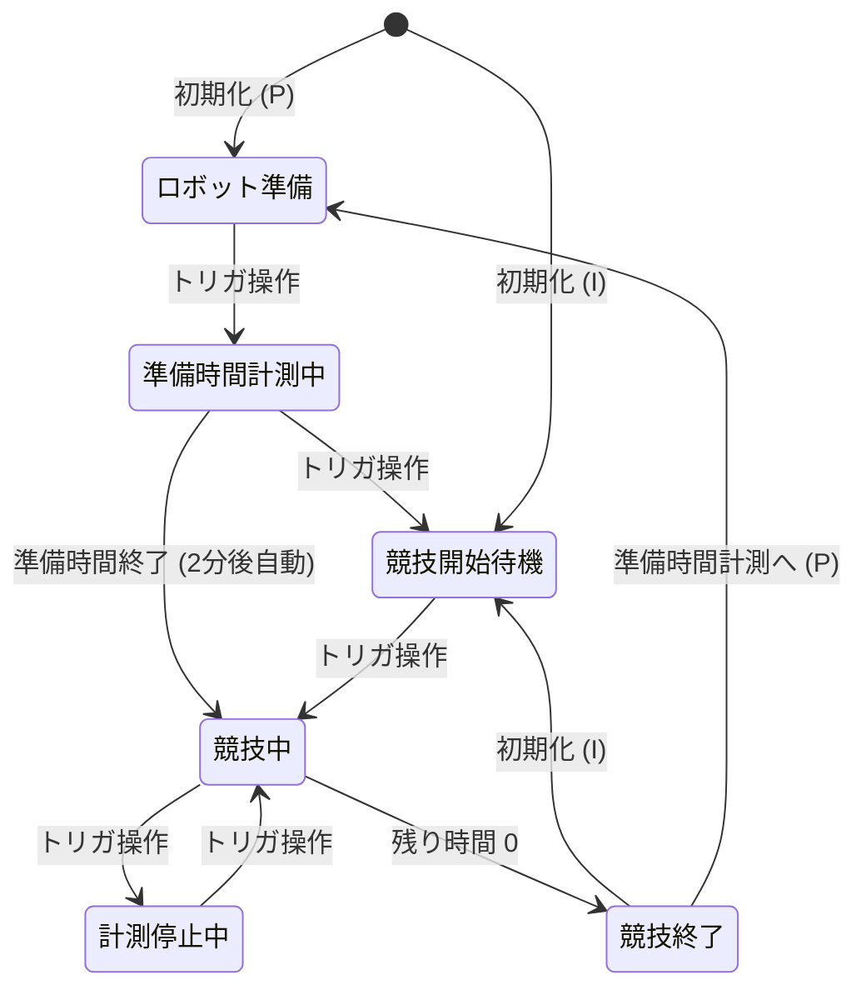

# IRCTimer マニュアル

## 画面構成

IRCTimerの画面は以下の要素で構成されています：

- **リトライカウンタ**: 右上に表示される「Retry:X」の表示（Xは回数）
- **タイマ表示部**: 中央の大きな数字で表示される残り時間
- **状態表示部**: 下部に表示される現在の状態（「競技開始待機」など）

## 操作方法

### キーボード操作

| キー | 機能 |
|------|------|
| スペース / Enter | トリガ操作（計測開始・一時停止など、[状態に応じた動作](#トリガ操作スペースenterキーの動作)を実行） |
| P | ロボット準備モードに初期化 |
| I | 競技開始待機モードに初期化 |
| L | 競技時間の変更 |
| + | リトライカウントを1増加 |
| - | リトライカウントを1減少 |

### トリガ操作（スペース/Enterキー）の動作

トリガ操作は計測開始、競技中に遷移、一時停止、再開のような動作となります。
現在の状態によって、トリガ操作の動作は異なります。

- **ロボット準備**状態: 準備時間計測を開始
- **準備時間計測中**状態: 競技開始待機状態に移行
- **競技開始待機**状態: 競技を開始
- **競技中**状態: 計測を一時停止（リトライカウント増加）
- **計測停止中**状態: 計測を再開
- **競技終了**状態: 操作無効

[状態と遷移](#状態と遷移)も参照

### 初期化操作

- **Pキー**: ロボット準備モードに初期化します（確認ダイアログあり）
- **Iキー**: 競技開始待機モードに初期化します（確認ダイアログあり）

[状態と遷移](#状態と遷移)も参照

### 競技時間の変更

1. **Lキー**を押します
2. 表示されるプロンプトに新しい競技時間を**秒単位**で入力します
   - 例: 5分 = 300秒
3. 競技開始待機状態の場合は即時反映、それ以外の状態では次回の競技開始待機時に反映されます

## リトライカウンタ

競技中に計測停止中状態に移行する（つまり、一時停止する）たびに、リトライカウントが1増加します。これにより、競技中に何回リトライが行われたかを記録できます。

また、以下のキー操作でリトライカウントを手動で調整できます：
- **+キー**: リトライカウントを1増加させます
- **-キー**: リトライカウントを1減少させます（0未満にはなりません）

## 状態と遷移

IRCTimerは以下の状態を持ち、トリガ操作によって状態が遷移します。

### 各状態の説明

1. **ロボット準備**
   - 準備時間（2分）のタイマーが表示されます
   - トリガー操作で準備時間の計測を開始します

2. **準備時間計測中**
   - 2分間のカウントダウンが行われます
   - トリガー操作で競技開始待機状態に移行できます
   - 2分経過すると自動的に競技中状態に移行します

3. **競技開始待機**
   - 競技時間（デフォルト5分）のタイマーが表示されます
   - トリガー操作で競技を開始します

4. **競技中**
   - 競技時間のカウントダウンが行われます
   - トリガー操作で計測停止中状態に移行します（リトライカウントが増加）
   - 時間切れになると競技終了状態に移行します

5. **計測停止中**
   - タイマーが一時停止します
   - トリガー操作で競技中状態に戻り、タイマーが再開します

6. **競技終了**
   - 競技時間が0になると表示されます
   - 初期化操作で次の競技に備えます
